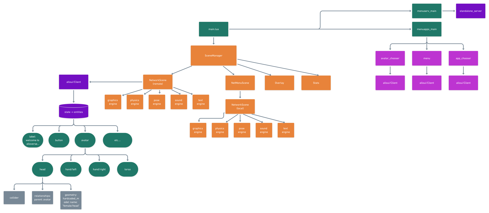

# Alloverse visor (Lua edition)

Allovisor is the "user interface" into the Alloverse. Use this Lovr app to connect to an Alloverse Place' and interact with the apps available in that place.

We [first tried to build the Alloverse visor in Unity](https://github.com/alloverse/allovisor-unity),
but have decided to switch to Lovr because it's easier and faster to develop
with, and easier to extend with low level functionality.

## Developing Allovisor

For all platforms:

* You must have [Git LFS](https://git-lfs.github.com) installed to fetch assets
* If LFS doesn't fetch assets for you automatically after cloning, do `git lfs install` followed by `git lfs pull`
* You must also fetch submodules: `git submodule update --init --recursive`

### Mac

#### Xcode project

1. Install CMake 3.18.4 or newer
2. `mkdir build && cd build && cmake -GXcode ..` to prepare to build
3. `open allovisor.xcodeproj`
4. Build and run the Alloverse target

When running from xcode the lua code will hot reload when any file in the lua folder is saved. This can be disabled from the scheme run arguments. 

If you're using Xcode 12.2 or newer, for now you'll have to opt into the old
build system. Change `cmake -GXcode ..` to `cmake -Tbuildsystem=1 -GXcode ..`.

#### make

1. Install CMake 3.13.0 or newer
2. `mkdir build && cd build && cmake ..` to prepare to build
3. In build, `make Alloverse` to build `Alloverse.app`.
4. You could now just double-click Alloverse.app, but then you'd need to recompile
   for each change. Instead, you can start it from the command line together with
   lodr to auto-reload whenever you change any lua source file. From `build`:

`./Alloverse.app/Contents/MacOS/lovr ../deps/lodr ../lua`

### Windows

1. Install Visual Studio 2019, including "C++ CMake tools for Windows" which comes with "Desktop development with C++".
2. Open the project folder in VS2019
3. In the Solution Explorer, right-click CMakeLists.txt and select "Generate CMake cache for allovisor"
4. Build and run the Alloverse.exe target

If you run Alloverse from Visual Studio, it won't find the lua sources since they're expected to be
in a folder adjacent to the exe. To solve this:

Either cd to `out/build/x64-debug` and `Alloverse.exe ../../../deps/lodr ../../../lua`, or set it up
in Visual Studio by right-clicking the target and changing "Debug and Launch settings" and adding
absolute paths to lodr and lua that work on your computer to the ALloverse target, something like this:

```
    {
      "type": "default",
      "project": "CMakeLists.txt",
      "projectTarget": "Alloverse.exe",
      "name": "Alloverse.exe",
      "args": [
        "C:\\Users\\nevyn\\Dev\\allovisor-lovr\\deps\\lodr",
        "C:\\Users\\nevyn\\Dev\\allovisor-lovr\\lua"
      ]
    }
```

### Linux

1. `sudo apt install libpulse-dev cmake git glt-lfs build-essential xorg-dev libglfw3-dev libluajit-5.1-dev libphysfs-dev libopenal-dev libode-dev libccd-dev libenet-dev llvm clang` or something like that
2. `mkdir build; cd build; cmake ..`
3. `make Alloverse; and ./Alloverse ../deps/lodr ../lua`

Random things:

* Here's my standard invocation, from build/: `make Alloverse; and ~/.steam/steam/ubuntu12_32/steam-runtime/run.sh gdb --args ./Alloverse ../deps/lodr ../lua`
* steam's libode is going to override lovr's, smashing the stack. Either use LOVR_SYSTEM_ODE, or set ODE_BUILD_SHARED to OFF to make it link statically 

### Oculus Quest or Pico Neo

This only works from a Mac or Linux machine.

1. Install CMake version 3.15.4 exactly. (2.19.2 also works)
2. Install Android Studio if you haven't already.
3. In Android Studio's SDK manager under the SDK Platforms tab, install SDK for API levels 26 (Quest) and 27 (Pico). Also install NDK (side-by-side) from the SDK-Tools tab.
4. [Enable developer mode on your Quest](https://developer.oculus.com/documentation/quest/latest/concepts/mobile-device-setup-quest/).
5. Add the android tools to your PATH
```
 export ANDROID_HOME=/Users/$USER/Library/Android/sdk
 export PATH=${PATH}:$ANDROID_HOME/tools:$ANDROID_HOME/platform-tools
```
6. Quest has old OS and needs an old java version. Java SE 8 is compatible. On mac you can install it with `brew install openjdk@8`. Follow link instructions at end of install.
7. Set your JAVA_HOME to the SE 8 installation
```
export JAVA_HOME=your_path_to_java8
```
8. Connect it to your computer, and ensure it shows up when you run `adb devices` in your terminal.
9. Configure to build the Alloverse.apk: `mkdir quest-build; cd quest-build;` and then comes the cmake invocation. It is INVOLVED. Look at `azure-pipelines.yml` under Quest or Pico to find all the `-DCMAKE_TOOLCHAIN_FILE=` and other tomfoolery. Note that you'll also have to set up signing keys and stuff.
10. Actually build it: `make Alloverse`
11. Upload to headset: `adb install alloverse-quest.apk`

Sample CMake invocation for Quest on Linux:

```
cmake -DCMAKE_TOOLCHAIN_FILE=$ANDROID_HOME/ndk/21.3.6528147/build/cmake/android.toolchain.cmake -DANDROID_ABI="arm64-v8a" -DANDROID_NATIVE_API_LEVEL=26 -DANDROID_BUILD_TOOLS_VERSION="30.0.4" -DANDROID_SDK=$ANDROID_HOME -DANDROID_KEYSTORE=/path_to/alloverse.keystore -DANDROID_KEYSTORE_PASS="pass:123456" -DJAVA_HOME="$JAVA_HOME" -DANDROID_VARIANT="quest" ..
```

* You need to match the ndk version with whatever you have locally
* Same for build tools
* same for JAVA_HOME

If you're setting up on Linux for the first time, you should also add java and adb to your path:
* `set -Ua fish_user_paths /home/nevyn/Android/Sdk/platform-tools`
* `set -Ua fish_user_paths /snap/android-studio/94/android-studio/jre/bin/`

If you are iterating on the native code parts, you can re-build and upload the api with this handy one-liner
from the `build` directory:

`cmake ..; and rm -rf *.apk deps/lovr/libs/arm7-64/liblovr.so deps/lovr/*.apk; and make Alloverse; and adb uninstall com.alloverse.visor; and adb install alloverse-quest.apk`

Note that this command deletes apks on disk (because the cmake integration is iffy and it doesn't know
to rebuild unless the apk AND liblovr.so is missing), and deletes from device (because signatures might mismatch).

If you are iterating on the lua code parts, it would be nice to upload just the lua files and
lodr could override the bundled sources to give the changes to you immediately, without even
having to restart the app on your Quest. If that had worked, you'd sync your source files like so:

`adb push --sync lua /sdcard/Android/data/com.alloverse.visor/files/.lodr`

... but that's waiting [for a card on clubhouse](https://app.clubhouse.io/alloverse/story/168/get-lodr-to-work-on-android-for-custom-alloverse-debug-apk)
to finish before it's possible.

If you get a build error something about class versions blah blah, you haven't set JAVA_HOME
to a valid Android Java version.

#### Debugging on Android

* Get console log relating to alloverse: `adb logcat LOVR:V openal:V "*:S"`
* Attach gdb doesn't work. If we had a gradle project we could've done: `~/Library/Android/sdk/ndk-bundle/ndk-gdb --project=deps/lovr-android/LovrApp/Projects/Android`

## Building Allovisor for distribution

_Note that builds are available on Azure Pipelines CI and you shouldn't need to make distribution builds from your machine._

After following the normal cmake steps from above,

* On Mac, just `make package` to make a dmg
* On Windows, `msbuild PACKAGE.vcproj` to make a NSIS installer
* On Quest and Pico, just distribute the apk from the development steps.

## Building Lua documentation

### Prerequisities
LDoc needs LuaFileSystem (via penlight) and the easiest way to get that is to install luarocks and get penlight through that. 

For example on OSX with homebrew you run 

`brew install luarocks && luarocks install penlight`

### Running the generator

`lua deps/ldoc/ldoc.lua -f markdown lua/scenes`

Append other paths to include as documentation is expanded and file structure is cleaned up. 

### Documenting your code

See [the LDoc manual](https://stevedonovan.github.io/ldoc/manual/doc.md.html).

## Project structure

[](https://whimsical.com/visor-arch-VcwXwV96sdavVFS9fgdu4z)

* App is started in main.lua; everything is set up from there.
* It uses mcclure's [`ent` library](https://github.com/mcclure/lovr-ent) to structure the
  app as a graph of scenes.
* It starts with a SceneManager which manages four basic scenes:
  * A _remote_ NetworkScene which interacts with the remote AlloPlace we're connected to,
    if any. If we're not connected, this is just nil.
  * A _local_ NetworkScene contained in a NetMenuScene which represents our local UI,
    mainly the main menu and the overlay menu. This NetworkScene is connected to the local menuscene standalone server.
  * Overlay UI for showing controls and other desktop UI, if run on a 2D display
  * Stats overlay for debugging
* NetworkScene contains an allonet client, which has a list of all entities. Each entity
  has a list of components.
* NetworkScene also contains a list of sub-engines, which are responsible for one section
  of place interaction each.
  * E g, `graphics_eng` is responsible for rendering meshes and materials for those entities
    that need it
  * `sound_eng` records and streams the microphone, and plays sound from other users
    and apps. And so on...
* The UI in the NetMenuScene is drawn by real bona-fide `alloapps` running on their own
  thread called `menuapps_main`. These are also connected to the standalone server
  and have their own complete client-side state each.